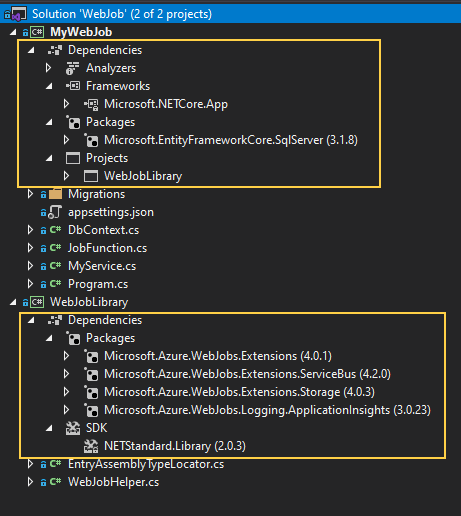
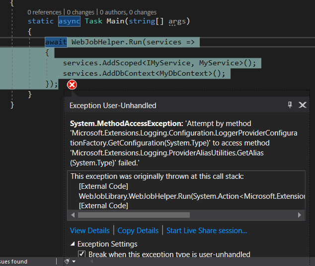

# Purpose of this project

The information provided in this repo is complimentary to the issue https://github.com/Azure/azure-webjobs-sdk/issues/2618.

The repo contains an example web job (see subfolder 'webjob') that reproduces a problem with transient dependencies when using azure webjobs sdk in conjunction with entity framework core and application insights.

# The webjob application

The application is a console app with the following dependencies.




# Error details

An exception is thrown during application startup. 

Exception message:

```
System.MethodAccessException: 'Attempt by method 'Microsoft.Extensions.Logging.Configuration.LoggerProviderConfigurationFactory.GetConfiguration(System.Type)' to access method 'Microsoft.Extensions.Logging.ProviderAliasUtilities.GetAlias(System.Type)' failed.'
```

Callstack:

```
This exception was originally thrown at this call stack:
    [External Code]
    WebJobLibrary.WebJobHelper.Run(System.Action<Microsoft.Extensions.DependencyInjection.IServiceCollection>) in WebJobHelper.cs
    [External Code]
    MyWebJob.Program.Main(string[]) in Program.cs
    [External Code]
```

## Visual studio screen shot




# Key insights
  
 * The azure web jobs sdk must be wrapped in a library which is referenced from the actual web job
 * Application insights must be initialized 

